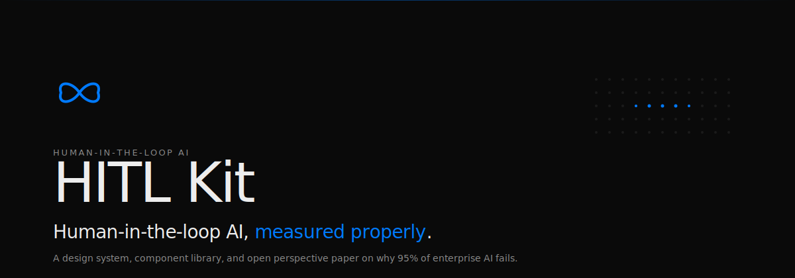

<picture>
  <source media="(prefers-color-scheme: dark)" srcset="./docs/banner.svg">
  <source media="(prefers-color-scheme: light)" srcset="./docs/banner.svg">
  
</picture>

# HITL Kit

> Human-in-the-loop AI, measured properly.

[**Read the paper**](https://www.hitlkit.dev/paper) · [**Browse components**](https://www.hitlkit.dev/components) · [**Registry install reference**](https://www.hitlkit.dev/registry) · [**GitHub**](https://github.com/akaieuan/HITL-KIT)

**Status:** v0.5a · Publicly deployed at [hitlkit.dev](https://www.hitlkit.dev). 11 primitives installable via shadcn CLI. `@hitl-kit/core`, `@hitl-kit/react`, `@hitl-kit/langgraph`, and `@hitl-kit/ai-sdk` on main. End-to-end demos for LangGraph interrupt/resume and Vercel AI SDK tool-calls at `apps/demo-langgraph`.

---

## Why this exists

**95% of enterprise AI pilots fail.** Not because the models are bad — because we measure the wrong thing.

Current benchmarks ask "can the model complete this task autonomously?" But in deployment, real users don't want autonomy. They want an assistant that respects their authority, preserves their agency, and makes them better over time. The benchmark-to-deployment gap is the gap between these two questions.

**HITL Kit is the argument that we should measure AI differently, and the components that make the alternative buildable.**

Three coordinated artifacts, one project:

### 1. A perspective paper

[**An AI Measurement Problem**](https://www.hitlkit.dev/paper). A synthesis of benchmark saturation research (Ott et al., 2022), cognitive-debt findings from AI-assisted learning (Kosmyna et al., 2025), scaffolding theory (Dhillon et al., 2024), uncertainty quantification (Liu et al., 2025), and the MIT NANDA enterprise failure report (Challapally et al., 2025). The paper argues for the **Assist-Not-Complete** paradigm: evaluate AI on whether it assists humans without displacing them, not on whether it can finish the task alone.

### 2. A component library

Eleven React primitives for human-in-the-loop agentic UIs. Each primitive is the physical embodiment of a specific claim from the paper. The [MiniTrace](https://www.hitlkit.dev/components#trace) instantiates the supporting-facts requirement from HotpotQA (Yang et al., 2018). The [AI Generation Scale](https://www.hitlkit.dev/components#ai-scale) operationalises Dhillon's scaffolding principle. The [Interrupt Card](https://www.hitlkit.dev/components#hitl) is the agency-preservation boundary. Every component ties to a research claim.

### 3. A shadcn-compatible registry

Every primitive installs with one CLI command:

```bash
npx shadcn@latest add https://www.hitlkit.dev/r/hitl-card.json
```

No fork, no vendor lock-in, no wrapper SDK. Same tokens, same Radix primitives, same Tailwind conventions as shadcn/ui. The CLI resolves transitive registry dependencies and npm deps automatically. Copy, paste, own.

Together: the paper is the argument, the components are the proof the argument is implementable, the registry is how you adopt it.

---

## The three artifacts (technical)

| Artifact | Distribution | Live at |
|---|---|---|
| **Paper** | Markdown in-repo, rendered on site | [hitlkit.dev/paper](https://www.hitlkit.dev/paper) |
| **Component library** (11 primitives) | Shadcn registry JSON endpoints | [hitlkit.dev/r/*.json](https://www.hitlkit.dev/registry) |
| **`@hitl-kit/core`** (Zod event schemas) | npm (workspace-linked, publish pending) | [packages/core](./packages/core) |
| **`@hitl-kit/react`** (`HitlEventRenderer`) | npm (workspace-linked, publish pending) | [packages/react](./packages/react) |

---

## Install a primitive

### Prerequisites

A Tailwind project with shadcn/ui initialized. If you don't have that yet:

```bash
npx shadcn@latest init
```

### Add HITL Kit accent tokens to your globals.css

HITL Kit primitives reference custom CSS variables for kind-semantic color. Paste this into `app/globals.css`:

```css
:root {
  --accent-violet:  #a78bfa;
  --accent-amber:   #fbbf24;
  --accent-emerald: #4ade80;
  --accent-rose:    #fb7185;
  --accent-blue:    #007AFF;
}
```

### Install

```bash
npx shadcn@latest add https://www.hitlkit.dev/r/hitl-card.json
```

The CLI resolves registry dependencies (`hitl-utils`, `hitl-types`) and npm dependencies (`lucide-react`) automatically.

Swap `hitl-card.json` for any primitive name from the table below. Full install reference with copy-buttons at [hitlkit.dev/registry](https://www.hitlkit.dev/registry).

---

## Use the event renderer (v0.3+)

For agentic UIs, pair the components with `@hitl-kit/core` (Zod event schemas) and `@hitl-kit/react` (`HitlEventRenderer`):

```bash
pnpm add @hitl-kit/core @hitl-kit/react
```

```tsx
import { createRegistry, HitlEventRenderer } from "@hitl-kit/react";
import { HitlCard } from "@/components/hitl/HitlCard";

const registry = createRegistry({
  "hitl.card": (event) => (
    <HitlCard
      config={{
        id: event.id ?? "default",
        kind: event.variant,
        title: event.title,
        subtitle: event.subtitle,
        steps: event.steps,
        runLabel: event.runLabel,
        editPlaceholder: event.editPlaceholder,
        openTab: "human",
      }}
    />
  ),
});

// later, when your agent emits a validated HITL event:
<HitlEventRenderer event={event} registry={registry} />;
```

The renderer validates the event at runtime via the shared Zod schema, narrows on `event.kind`, and mounts the primitive you registered for that kind. Works identically no matter which agent framework produced the event.

---

## Use with LangGraph (v0.4)

`@hitl-kit/langgraph` turns LangGraph's native `interrupt()` / `Command({ resume })` primitive into a typed HITL event producer. The graph pauses, the UI renders a primitive via `<HitlEventRenderer />`, the human acts, the graph resumes. End-to-end, no glue.

```bash
pnpm add @hitl-kit/core @hitl-kit/react @hitl-kit/langgraph @langchain/langgraph
```

Emit an interrupt inside a graph node:

```ts
import { StateGraph, interrupt } from "@langchain/langgraph";
import { createHitlCardInterrupt } from "@hitl-kit/langgraph";

// inside a node...
const approval = interrupt(
  createHitlCardInterrupt({
    variant: "review",
    title: "Citation needs verification",
    subtitle: "IPCC 2023 · p. 12",
    steps: [
      { label: "Flagged by agent", done: true },
      { label: "Confirm", done: false },
    ],
    runLabel: "Confirm & continue",
  }),
);
// graph pauses; Command({ resume: { approved: true } }) causes this line to return { approved: true }
```

On the client, guard with `isHitlInterrupt` and render through the same `<HitlEventRenderer />`:

```tsx
import { isHitlInterrupt } from "@hitl-kit/langgraph";
import { HitlEventRenderer } from "@hitl-kit/react";

if (isHitlInterrupt(interruptValue)) {
  return <HitlEventRenderer event={interruptValue.event} registry={registry} onAction={onResume} />;
}
```

Every primitive has a matching `create<Name>Interrupt` helper that validates against the core Zod schema at emit time, so a malformed event throws inside the graph node rather than surfacing on the client.

**Working demo**: [`apps/demo-langgraph`](./apps/demo-langgraph) — a minimal Next.js app that runs a LangGraph with one interrupt node, renders the Interrupt Card, accepts approval, and resumes the graph. Run it locally with `pnpm --filter demo-langgraph dev`.

---

## Use with Vercel AI SDK (v0.5a)

`@hitl-kit/ai-sdk` provides 11 typed `tool()` wrappers — one per HITL Kit primitive — that return validated HITL events as tool results. Since AI SDK has no native interrupt primitive, the adapter returns "awaiting human" as a tool-call result; the consumer renders the event and appends a follow-up user message to continue the conversation.

```bash
pnpm add @hitl-kit/core @hitl-kit/react @hitl-kit/ai-sdk ai zod
```

Server side, drop the tools into your `generateText` or `streamText` call:

```ts
import { generateText } from "ai";
import { hitlCardTool, approveRejectTool } from "@hitl-kit/ai-sdk";

const result = await generateText({
  model,
  messages,
  tools: {
    requestHumanReview: hitlCardTool({
      description: "Request human review of a citation before writing it.",
    }),
    requestApproval: approveRejectTool(),
  },
});
// If the model calls requestHumanReview, the tool result is a validated HitlCardEvent.
```

Or import all 11 at once:

```ts
import { allHitlTools } from "@hitl-kit/ai-sdk";
await generateText({ model, messages, tools: allHitlTools });
```

Client side, filter for HITL tool results and render:

```tsx
import { isHitlToolResult } from "@hitl-kit/ai-sdk";
import { HitlEventRenderer } from "@hitl-kit/react";

{toolResults.filter(isHitlToolResult).map((r) => (
  <HitlEventRenderer event={r.result} registry={registry} onAction={handle} />
))}
```

**Working demo**: [`apps/demo-langgraph/app/ai-sdk`](./apps/demo-langgraph/app/ai-sdk) — an AI SDK flow showing a typed tool call producing a validated HitlCardEvent, rendering it via `<HitlEventRenderer />`, and composing the follow-up user message on approve/dismiss. Run with `pnpm --filter demo-langgraph dev`, then open `/ai-sdk`.

---

## The 11 primitives

Every primitive is the physical embodiment of a claim from the paper.

| Component | What it is |
|---|---|
| `hitl-card` | In-thread approval boundary for agent actions. Three variants, four states. |
| `subagent-status-card` | Single-row agent status. Six execution states (idle, running, completed, error, skipped, cancelled). |
| `mini-trace` | Collapsible thought → action → result viewer. Supporting-facts pattern from §3.3 of the paper. |
| `ai-generation-scale` | Five-segment ordinal of AI vs. human contribution. Dhillon scaffolding principle. |
| `context-chips` | Removable pill chips for notes, files, URLs. |
| `qa-flow` | Multi-question approval card. Single, multi, text. |
| `writing-agent` | Compound widget for a draft-in-progress document with six status states. |
| `research-agent` | Three-mode research config: create, follow-up, read URL. |
| `batch-queue` | Sequential approve and reject across mixed agent items. |
| `search-result-card` | Ranked result with relevance bar and metadata. |
| `approve-reject-row` | The canonical binary decision row. |

Plus 3 shared-lib items (`hitl-utils`, `hitl-types`, `hitl-subagent-meta`) and one `shared-primitives` palette for the atomic design tokens.

---

## What's in this repo

```
.
├── content/paper.md              The perspective paper (markdown)
├── docs/banner.svg               README hero image
├── registry.json                 Shadcn registry manifest
├── public/r/*.json               Built registry endpoints (15 files)
├── apps/
│   └── demo-langgraph/           End-to-end LangGraph interrupt/resume demo
├── packages/
│   ├── core/                     @hitl-kit/core (Zod event schemas)
│   ├── react/                    @hitl-kit/react (HitlEventRenderer)
│   ├── langgraph/                @hitl-kit/langgraph (interrupt helpers)
│   └── ai-sdk/                   @hitl-kit/ai-sdk (Vercel AI SDK tool wrappers)
├── src/
│   ├── app/                      Next.js App Router pages
│   │   ├── page.tsx              Landing
│   │   ├── components/page.tsx   Live component showcase
│   │   ├── paper/page.tsx        Paper renderer
│   │   ├── registry/page.tsx     Install-command reference
│   │   └── test/                 Dev-only registry health dashboard
│   ├── components/
│   │   ├── hitl/                 The 11 primitives + 3 shared lib files
│   │   └── site/                 Nav, Footer, brand bits
│   └── lib/                      cn helper, content constants
├── scripts/smoke-test.sh         End-to-end install smoke test
├── .github/workflows/            CI (registry drift check)
└── CONTRIBUTING.md               Verification and branch protocol
```

---

## Local development

```bash
pnpm install
pnpm dev                # dev server at http://localhost:3000
pnpm verify             # typecheck + registry drift check + build (run before pushing)
pnpm smoke-test         # end-to-end install test (requires dev server running)
pnpm registry:build     # regenerate public/r/*.json after editing a primitive
pnpm packages:build     # build both @hitl-kit/* packages via tsup
```

The verification pipeline and contribution protocol are documented in [CONTRIBUTING.md](./CONTRIBUTING.md). Substantial changes should land on a feature branch first so Vercel builds a preview deployment before merging.

---

## Tech stack

- **Next.js 16** (App Router) + React 19
- **Tailwind CSS v4** (native `@theme` inline)
- **TypeScript 5**
- **shadcn CLI** for registry building
- **Zod 3** for event schemas (`@hitl-kit/core`)
- **lucide-react** for icons
- **react-markdown** + remark-gfm for the paper renderer
- **Geist + JetBrains Mono** for typography
- **LangGraph 1.x** via `@hitl-kit/langgraph`
- **Vercel AI SDK 6.x** via `@hitl-kit/ai-sdk`
- **pnpm workspace** monorepo (`packages/core`, `packages/react`, `packages/langgraph`, `packages/ai-sdk`, `apps/demo-langgraph`, root site)

No global state, no CSS-in-JS runtime, no wrapper SDK. Every component is copy-paste ready and yours to edit once installed.

---

## Roadmap

| Version | Scope | Status |
|---|---|---|
| **v0.1** | Reference site, 11 primitives as source, paper, shadcn registry built | ✅ Shipped |
| **v0.2** | Deployed to Vercel at hitlkit.dev. Branded registry URLs at `hitlkit.dev/r/*.json`. `npx shadcn@latest add` verified end-to-end from the public domain. Loop favicon, MIT LICENSE, AssistNotComplete link component. | ✅ Shipped |
| **v0.2.1** | GitHub Action (`.github/workflows/registry.yml`) rebuilds the registry on every push/PR and fails CI if `public/r/*.json` drifts from `registry.json`. Contributors have to run `pnpm registry:build` and commit the result. Includes `pnpm verify` / `pnpm smoke-test` + dev-only `/test` dashboard. | ✅ Shipped |
| **v0.3** | `@hitl-kit/core` Zod event schemas for all 11 primitives + `@hitl-kit/react` `<HitlEventRenderer />` dispatcher. pnpm workspace monorepo. Workspace-linked, npm publish pending. | ✅ Shipped |
| **v0.4** | `@hitl-kit/langgraph` adapter with `create<Name>Interrupt` helpers for all 11 primitives, `isHitlInterrupt` type guard. `apps/demo-langgraph` Next.js demo with a real LangGraph `interrupt()` → `<HitlEventRenderer />` → `Command({ resume })` flow, end-to-end verified via HTTP. | ✅ Shipped |
| **v0.5a** | `@hitl-kit/ai-sdk` adapter: 11 typed `tool()` wrappers returning validated HitlEvents. `allHitlTools` bundle + `isHitlToolResult` type guard. Demo tab added to `apps/demo-langgraph` at `/ai-sdk`, verified end-to-end via HTTP. | ✅ Shipped |
| **v0.5b** | `@hitl-kit/mcp` MCP server exposing primitives as tools for Claude Code / Cursor / Claude Desktop. | Planned |

**The v0.3+ ambition is LLM pluggability.** An agent running in LangGraph, Vercel AI SDK, Claude Agent SDK, or any MCP-aware client emits a structured HITL event matching a Zod schema. The renderer validates, narrows by `event.kind`, and mounts the right primitive. Tool call → UI, no wiring per component. The paper becomes the protocol; the protocol becomes the platform.

---

## Contributing

Issues and PRs welcome. Open an issue first for substantial changes so we can agree on scope.

The verification and branch protocol is documented in [CONTRIBUTING.md](./CONTRIBUTING.md):

- `pnpm verify` before every push
- `pnpm smoke-test` for anything touching primitives or the registry
- Feature branch + Vercel preview for substantial changes (new primitives, package restructures)
- CI fails if `public/r/*.json` is stale

Good first contributions:

- Prop API polish on any primitive
- Accessibility improvements (ARIA, keyboard navigation)
- A new primitive with a clear HITL use case, plus its entry in `registry.json`
- Documentation fixes or better Zod schema types in `packages/core`

---

## License

[MIT](./LICENSE). Do what you want.

---

## Credits

Built by [Ieuan King](https://aka4uh.com) ([@akaieuan](https://x.com/akaieuan)).

The component set was originally extracted from [Agatha](https://aka4uh.com), a research-agent workspace, and generalized into an open primitive library.

The paper synthesizes work from Challapally et al. (MIT NANDA 2025), Dhillon et al. (CHI 2024), Kosmyna et al. (MIT 2025), Ott et al. (Nature Comm 2022), Yang et al. (HotpotQA 2018), Zanzotto (JAIR 2019), Liu et al. (2025), and others. Full references in the paper.
