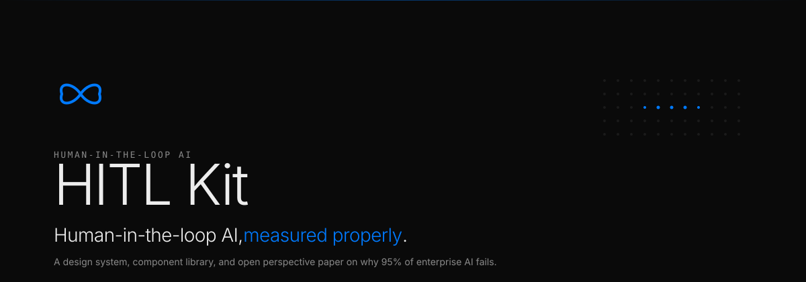

<picture>
  <source media="(prefers-color-scheme: dark)" srcset="./docs/banner.svg">
  <source media="(prefers-color-scheme: light)" srcset="./docs/banner.svg">
  
</picture>

# HITL Kit

> Human-in-the-loop primitives for agentic UIs.

HITL Kit is part of [**akaOSS**](https://www.akaoss.dev) — the site, docs, [paper](https://www.akaoss.dev/paper), and [component registry](https://www.akaoss.dev/registry) live at [akaoss.dev](https://www.akaoss.dev). **This repo is the `@hitl-kit/*` library monorepo**: seven packages (the UI primitives included), the LangGraph demo app, and design docs.

[**Project page**](https://www.akaoss.dev/projects/hitl-kit) · [**Components gallery**](https://www.akaoss.dev/components) · [**Registry**](https://www.akaoss.dev/registry) · [**Paper**](https://www.akaoss.dev/paper)

---

## Why it exists

95% of enterprise AI pilots fail — not because the models are bad, but because we measure the wrong thing. Current benchmarks ask *"can the model complete this task autonomously?"* Deployment asks *"does it respect the user's authority, preserve their agency, and make them better over time?"* The gap between those two questions is where pilots die — and every primitive in this kit exists because something falls into it.

The design discipline: each of the twenty UI primitives (one per event kind, plus the scale family) is the physical embodiment of a specific claim from [An AI Measurement Problem](https://www.akaoss.dev/paper). The MiniTrace instantiates HotpotQA's supporting-facts requirement; the AI Generation Scale operationalises Dhillon et al.'s scaffolding findings; the Interrupt Card is the agency-preservation boundary. If a primitive can't be tied to a claim the paper defends, it doesn't ship. The packages below carry that protocol into real agent stacks. Full deep-dive: [akaoss.dev/projects/hitl-kit](https://www.akaoss.dev/projects/hitl-kit).

## Packages

| Package | Version | Description |
|---|---|---|
| [`@hitl-kit/core`](https://www.npmjs.com/package/@hitl-kit/core) | 0.5.0 | Zod event schemas for human-in-the-loop AI primitives. Framework-agnostic protocol shared by every HITL Kit adapter. |
| [`@hitl-kit/react`](https://www.npmjs.com/package/@hitl-kit/react) | 0.4.2 | `HitlEventRenderer`, a typed dispatcher that maps validated HITL events to React primitives. Pair with `@hitl-kit/core` and `@hitl-kit/ui` (or the shadcn-installed copies). |
| [`@hitl-kit/ui`](./packages/ui) | 0.1.0 (unpublished) | The twenty UI primitives as one package: props are the core event spread, every decision comes back through one typed `onAction`. The shadcn registry is generated from it. |
| [`@hitl-kit/gates`](https://www.npmjs.com/package/@hitl-kit/gates) | 0.2.0 | Composable decision gates (confidence, cost, scope, approval chain, rate limit). Pure functions that wrap any adapter's emit point and decide allow / deny / escalate. |
| [`@hitl-kit/langgraph`](https://www.npmjs.com/package/@hitl-kit/langgraph) | 0.6.1 | LangGraph adapter. Emit schema-conformant HITL events from LangGraph `interrupt()` nodes and resume with typed `Command` payloads. |
| [`@hitl-kit/ai-sdk`](https://www.npmjs.com/package/@hitl-kit/ai-sdk) | 0.7.1 | Vercel AI SDK adapter. Typed `tool()` wrappers that return schema-conformant HITL events so `<HitlEventRenderer />` can dispatch them client-side. |
| [`@hitl-kit/mcp`](https://www.npmjs.com/package/@hitl-kit/mcp) | 0.8.0 | MCP server exposing the 16 HITL primitive event kinds as MCP tools, so Claude Code, Cursor, Claude Desktop, and any MCP-aware client can emit schema-validated human-in-the-loop events. |

---

## Install

The library packages install from npm:

```bash
pnpm add @hitl-kit/core @hitl-kit/react
```

The UI primitives come two ways from one source, [`packages/ui`](./packages/ui). As a package:

```bash
pnpm add @hitl-kit/ui   # once published; the workspace uses it today
```

Or the shadcn way, copy-paste-own, from the registry generated out of that package (served by the akaOSS site; these URLs keep working):

```bash
npx shadcn@latest add https://www.hitlkit.dev/r/hitl-card.json
```

The CLI resolves registry dependencies (`hitl-utils`, `hitl-shared`, `hitl-types`) and npm dependencies (`lucide-react`, `@hitl-kit/core`) automatically. Browse every primitive with copy-paste install commands at [akaoss.dev/registry](https://www.akaoss.dev/registry), and see them live at [akaoss.dev/components](https://www.akaoss.dev/components).

---

## Use the event renderer

For agentic UIs, pair the components with `@hitl-kit/core` (Zod event schemas) and `@hitl-kit/react` (`HitlEventRenderer`). Every primitive's props are the event spread, and every decision comes back through one `onAction` whose payload is typed in core:

```tsx
import { createRegistry, HitlEventRenderer } from "@hitl-kit/react";
import { HitlCard } from "@hitl-kit/ui";

const registry = createRegistry({
  "hitl.card": (event) => (
    <HitlCard
      {...event}
      onAction={(a) => {
        // a.kind: "approve" (with the human's note) | "dismiss" | "undo" | "retry"
        resume(a);
      }}
    />
  ),
});

// later, when your agent emits a validated HITL event:
<HitlEventRenderer event={event} registry={registry} />;
```

The renderer validates the event at runtime via the shared Zod schema, narrows on `event.kind`, and mounts the primitive you registered for that kind. Works identically no matter which agent framework produced the event. The action vocabulary is shared across surfaces (`approve` / `reject` / `abstain` / `undo` / …), so a consumer switching on `action.kind` never learns a primitive's private verbs; see [docs/unified-ui.md](./docs/unified-ui.md).

---

## Use with LangGraph

`@hitl-kit/langgraph` turns LangGraph's native `interrupt()` / `Command({ resume })` primitive into a typed HITL event producer. The graph pauses, the UI renders a primitive via `<HitlEventRenderer />`, the human acts, the graph resumes. End-to-end, no glue.

```bash
pnpm add @hitl-kit/core @hitl-kit/react @hitl-kit/langgraph @langchain/langgraph
```

```ts check
import { StateGraph, interrupt } from "@langchain/langgraph";
import { createHitlCardInterrupt } from "@hitl-kit/langgraph";

// inside a node...
const approval = interrupt(
  createHitlCardInterrupt({
    variant: "review",
    title: "Citation needs verification",
    subtitle: "IPCC 2023 · p. 12",
    steps: [
      { label: "Flagged by agent", done: true },
      { label: "Confirm", done: false },
    ],
    runLabel: "Confirm & continue",
  }),
);
// graph pauses; Command({ resume: { approved: true } }) causes this line to return { approved: true }
```

On the client, guard with `isHitlInterrupt` and render through the same `<HitlEventRenderer />`. Every primitive has a matching `create<Name>Interrupt` helper that validates against the core Zod schema at emit time, so a malformed event throws inside the graph node rather than surfacing on the client.

---

## Use with Vercel AI SDK

`@hitl-kit/ai-sdk` provides 16 typed `tool()` wrappers — one per HITL Kit primitive — that return validated HITL events as tool results. Since AI SDK has no native interrupt primitive, the adapter returns "awaiting human" as a tool-call result; the consumer renders the event and appends a follow-up user message to continue the conversation.

```bash
pnpm add @hitl-kit/core @hitl-kit/react @hitl-kit/ai-sdk ai zod
```

```ts
import { generateText } from "ai";
import { hitlCardTool, approveRejectTool, allHitlTools } from "@hitl-kit/ai-sdk";

const result = await generateText({
  model,
  messages,
  tools: {
    requestHumanReview: hitlCardTool({
      description: "Request human review of a citation before writing it.",
    }),
    requestApproval: approveRejectTool(),
  },
});
// If the model calls requestHumanReview, the tool result is a validated HitlCardEvent.
// Or pass all 16 at once: tools: allHitlTools
```

Client side, filter for HITL tool results with `isHitlToolResult` and render each through `<HitlEventRenderer />`.

---

## Add gates

A gate is a pure decision function: confidence too low? cost over budget? scope outside what's allowed? deny — and (default) surface a HITL escalation card so the human can override. Same renderer pipeline handles allow- and block-paths.

```bash
pnpm add @hitl-kit/gates
```

```ts check
import {
  composeGates,
  confidenceGate,
  costGate,
  scopeGate,
  rateLimitGate,
  inMemoryStore,
} from "@hitl-kit/gates";

const store = inMemoryStore();

const gates = [
  confidenceGate({ min: 0.85 }),
  costGate({ maxUsd: 0.10 }),
  scopeGate({ allowed: ["read:files", "read:web"] }),
  rateLimitGate({ store, key: (ctx) => ctx.signals?.userId ?? "anon", max: 30, windowSec: 60 }),
];
```

Wire them in via the adapter helpers:

```ts
// LangGraph
import { withGates } from "@hitl-kit/langgraph";
const gated = await withGates(payload, gates, { signals });
const approval = interrupt(gated);

// Vercel AI SDK
import { withGates } from "@hitl-kit/ai-sdk";
const tool = withGates(hitlCardTool(), gates, { signals: (input) => deriveSignals(input) });

// MCP — gates configured at server creation
import { createHitlKitServer } from "@hitl-kit/mcp";
const server = createHitlKitServer({ gates, onDeny: "escalate" });
```

When a gate denies with the default `onDeny`, the result is the gate's escalation `HitlEvent` — feed it to the same `<HitlEventRenderer />` you already use. Full details in [packages/gates/README.md](./packages/gates/README.md).

---

## Use with MCP · Claude Code, Cursor, Claude Desktop

`@hitl-kit/mcp` is an MCP server that exposes all 16 primitive event kinds as tools. Drop it into any MCP-aware client and every client's agent can emit schema-validated HITL events. No per-client adapter code.

### Claude Desktop

Edit `~/Library/Application Support/Claude/claude_desktop_config.json` (macOS) or `%APPDATA%\Claude\claude_desktop_config.json` (Windows):

```json
{
  "mcpServers": {
    "hitl-kit": {
      "command": "npx",
      "args": ["-y", "@hitl-kit/mcp"]
    }
  }
}
```

### Claude Code

```bash
claude mcp add hitl-kit npx -y @hitl-kit/mcp
```

### Cursor

Cursor Settings → MCP Servers → Add, same JSON as Claude Desktop.

Once registered and the client is restarted, `hitl_interrupt_card`, `hitl_qa_flow`, and 14 more tools are available. Each validates input against the core Zod schema and returns a JSON `HitlEvent` ready for your UI.

---

## Demo app

[`apps/demo-langgraph`](./apps/demo-langgraph) is a minimal Next.js app that exercises the whole pipeline end-to-end: a LangGraph with a real `interrupt()` node, the Interrupt Card rendered via `<HitlEventRenderer />`, approval, and `Command({ resume })`. It also has tabs for the AI SDK flow (`/ai-sdk`), gates (`/gates`), and the v0.6a primitives (`/diff`, `/citation`, `/plan`, `/tool-call`).

```bash
pnpm install
pnpm --filter demo-langgraph dev   # http://localhost:3100
```

---

## What's in this repo

```
.
├── packages/
│   ├── core/                     @hitl-kit/core (Zod event schemas)
│   ├── react/                    @hitl-kit/react (HitlEventRenderer)
│   ├── ui/                       @hitl-kit/ui (the 20 primitives; registry/ generated from src/)
│   ├── gates/                    @hitl-kit/gates (5 composable decision gates)
│   ├── langgraph/                @hitl-kit/langgraph (interrupt helpers + withGates)
│   ├── ai-sdk/                   @hitl-kit/ai-sdk (Vercel AI SDK tool wrappers + withGates)
│   └── mcp/                      @hitl-kit/mcp (MCP stdio server with gate hooks, hitl-kit-mcp bin)
├── apps/
│   └── demo-langgraph/           End-to-end LangGraph interrupt/resume demo (port 3100)
├── docs/
│   ├── unified-ui.md             One primitive library: the decision record
│   ├── api-unification.md        The proposal it executed (historical)
│   └── EVAL_KIT_BRIEF.md         Historical design brief
├── .github/workflows/ci.yml     Build → typecheck → test → audit
└── CONTRIBUTING.md              Verification and branch protocol
```

The studio site and the paper source live in [akaieuan/akaOSS](https://github.com/akaieuan/akaOSS), served at [akaoss.dev](https://www.akaoss.dev) and [hitlkit.dev](https://www.hitlkit.dev). The site's copy of the primitives and the registry JSON it serves are generated from `packages/ui` (`pnpm hitl:sync` there), never edited by hand. Registry install URLs (`hitlkit.dev/r/*.json`) are unaffected.

---

## Development

```bash
pnpm install
pnpm packages:build       # build all @hitl-kit/* packages via tsup
pnpm packages:typecheck   # tsc --noEmit in every package
pnpm test                 # vitest across packages/*/src
pnpm registry:check       # the shadcn registry in packages/ui/registry matches its source
pnpm verify               # all of the above, in order — run before pushing
```

### Testing

Vitest runs against `packages/*/src` only. Currently **80 tests across 21 files**: round-trip parse for every event kind + exhaustiveness + frozen fixtures in `@hitl-kit/core`, every gate factory, compose, store, rate-limit, and approval chain in `@hitl-kit/gates`, integration tests per adapter (`withGates` allow + escalate + throw), and a one-component-per-event-kind check in `@hitl-kit/ui`.

```bash
pnpm test          # single run
pnpm test:watch    # watch mode
```

---

## Contributing

Issues and PRs welcome. Open an issue first for substantial changes so we can agree on scope. The verification and branch protocol is documented in [CONTRIBUTING.md](./CONTRIBUTING.md) — `pnpm verify` before every push; CI runs build → typecheck → test plus a dependency audit that fails on high or critical advisories.

Good first contributions:

- Accessibility improvements (ARIA, keyboard navigation) in `packages/ui`
- Better Zod schema types in `packages/core`
- Documentation fixes

Component and registry contributions belong in [`packages/ui`](./packages/ui); the site's copy is generated from it.

---

## License

[MIT](./LICENSE). Do what you want.

---

## Credits

Built by [Ieuan King](https://aka4uh.com) ([@akaieuan](https://x.com/akaieuan)).

The component set was originally extracted from [Agatha](https://aka4uh.com), a research-agent workspace, and generalized into an open primitive library. The perspective paper behind the project — [An AI Measurement Problem](https://www.akaoss.dev/paper) — argues for the Assist-Not-Complete paradigm: evaluate AI on whether it assists humans without displacing them, not on whether it can finish the task alone.
